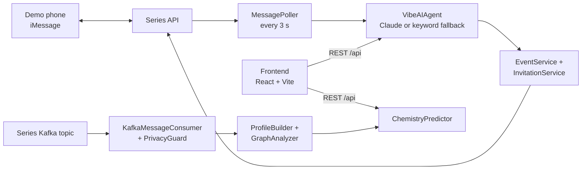

# Series Events

**Plan events with people who will actually get along.**

Series Events is a hackathon project built on the Series iMessage API. It scores the group chemistry of a guest list from messaging metadata, and lets you create and manage events by talking to an AI assistant called Vibe, either over iMessage or in a web chat. Message content is never stored. Only timestamps, lengths and hashed IDs are used.

## What it does

- **Chemistry prediction.** Each person gets a communication profile: response time, active hours, message frequency, group participation, verbosity, and social-graph metrics such as betweenness centrality and clustering. `ChemistryPredictor` combines pairwise compatibility, energy balance and catalyst or dominator counts into a group score with insights and warnings. It can also suggest who to add or remove.
- **Conversational event management.** The Vibe agent classifies a message into `create_event`, `rsvp`, `update_event`, `cancel_event` or `query` using Claude, and falls back to keyword matching when no Anthropic key is set. It creates the event, sends invitations, and replies in natural language.
- **iMessage in and out.** A poller checks the Series API every 3 seconds for new messages, so no webhook is needed. Replies, invitations, reminders and group-chat messages go back out through the same API. Only the two demo phone numbers are processed. Everyone else is ignored.
- **Web chat.** The frontend has a `/chat` page that talks to the same agent over `POST /api/chat`, with history kept in memory on the server.
- **Kafka profile building.** With Series Kafka credentials, the backend consumes the team topic, strips each message down to metadata with `PrivacyGuard`, and updates profiles and the social graph in batches. Without credentials it generates mock messages and builds profiles from those.
- **Privacy endpoints.** `GET /api/privacy/export/:userId` and `DELETE /api/privacy/delete/:userId` let a user export or remove their profile.

## How it works



The backend is a single Express process. On start it loads Series credentials from the environment, connects to Kafka if it can, builds profiles (real or mock), then starts the poller and the HTTP API on port 3001. Everything lives in memory. Restarting the server drops all events, profiles and chat history.

More detail is in [CONVERSATIONAL_EVENTS.md](./CONVERSATIONAL_EVENTS.md), [KAFKA_MESSAGE_PROCESSING.md](./KAFKA_MESSAGE_PROCESSING.md), [WEB_CHAT_IMPLEMENTATION.md](./WEB_CHAT_IMPLEMENTATION.md) and [DEMO_GUIDE.md](./DEMO_GUIDE.md).

## Quick start

You need Node 18+ and npm. Series and Anthropic credentials are optional. Without them the backend runs in mock mode and the agent uses keyword matching.

**1. Backend**

```bash
cd backend
npm install
npm run dev                       # http://localhost:3001/api
```

**2. Frontend**

```bash
cd frontend
echo "VITE_API_URL=http://localhost:3001/api" > .env
npm install
npm run dev                       # http://localhost:8080
```

The `.env` line is required. The chat page reads `VITE_API_URL` with no fallback.

**3. Log in**

Go to `/login` and use one of the demo users with password `123`:

- Sarah Kim, `+14843693839`
- Alex Thompson, `+19178615579`

Then open `/chat` and try "Create dinner Friday at 7pm with Sarah" or "What events do I have?".

**iMessage instead of web chat**

Set the Series variables below and text the sender number from one of the demo phones. The poller picks the message up and the agent replies over iMessage.

## Configuration

All settings are environment variables. The backend loads `backend/.env` through `dotenv`.

| Variable | Used by | Purpose |
|----------|---------|---------|
| `PORT` | backend | HTTP port (default `3001`). |
| `SERIES_API_KEY`, `SERIES_SENDER_PHONE` | backend | Series iMessage API key and the E.164 number the bot sends from. Both are needed for polling and outbound messages. |
| `SERIES_API_BASE_URL` | backend | Series API base URL. Defaults to the hackathon service. |
| `USE_SERIES_API` | backend | Set to `true` to connect to Series Kafka. Ignored if the Kafka variables are missing. |
| `SERIES_KAFKA_BROKERS`, `SERIES_KAFKA_TOPIC`, `SERIES_KAFKA_GROUP_ID`, `SERIES_KAFKA_CLIENT_ID` | backend | Confluent Cloud connection. All four are required for Kafka. Brokers are comma separated. |
| `SERIES_KAFKA_SASL_USERNAME`, `SERIES_KAFKA_SASL_PASSWORD` | backend | Enables `SASL_SSL` with `PLAIN`. Without them the consumer uses `PLAINTEXT`. |
| `ANTHROPIC_API_KEY` | backend | Enables Claude for intent classification. Unset falls back to keyword matching. |
| `HASH_SALT` | backend | Salt for hashing user and conversation IDs (default `series-events-salt`). |
| `FRONTEND_URL` | backend | Allowed CORS origin. |
| `LOG_LEVEL`, `NODE_ENV` | backend | Winston log level and environment. |
| `VITE_API_URL` | frontend | Backend API base, e.g. `http://localhost:3001/api`. Required for the chat page. |
| `VITE_USE_BACKEND` | frontend | Set to `false` to compute chemistry in the browser instead of calling the backend. |
| `API_URL`, `TEST_PHONE` | scripts | Used by `scripts/test-invite.ts` and `scripts/test-imessage.ts`. |

Generic `KAFKA_*` variables are not read. The backend only accepts `SERIES_KAFKA_*` so it cannot connect to the wrong topic.

## Project layout

```
backend/                Express + TypeScript API
├── src/
│   ├── index.ts              boots services, Kafka, the poller and the HTTP server
│   ├── api/                  routes.ts and middleware.ts
│   ├── models/               Event, CommunicationProfile, ChemistryAnalysis, DemoProfiles, SeriesConfig
│   ├── services/             chemistryPredictor, profileBuilder, graphAnalyzer, eventService,
│   │                         invitationService, inboundMessageHandler (Vibe), messagePoller,
│   │                         kafkaConsumer, chatMessageStore
│   └── utils/                privacy.ts (PrivacyGuard), calculations, logger, mockDataGenerator
├── scripts/                demo.ts, test-imessage.ts, test-invite.ts, test-message-poller.ts
├── tests/                  vitest unit tests for ChemistryPredictor
├── Dockerfile, docker-compose.yml
└── README.md, SERIES_SETUP.md, RATE_LIMITS.md
frontend/               React + Vite + Tailwind + shadcn/ui
└── src/pages/              Login, Chat, CreateEvent, GuestListBuilder, EventDashboard,
                            EventDetail, EditEvent, Privacy
ai-social-finder/       Separate Lovable-generated UI prototype with mock profiles. Not wired to the backend.
```

## API

All routes are under `/api`. The frontend uses the `-frontend` variants, which accept and return the shapes in `models/FrontendModels.ts`.

| Route | Purpose |
|-------|---------|
| `GET /health` | Liveness |
| `GET /profile/:userId`, `GET /profiles` | Communication profiles |
| `POST /chemistry/predict`, `POST /chemistry/optimize`, `POST /chemistry/individual` | Group score, guest-list optimisation, single-person analysis |
| `POST /events`, `GET /events/:eventId`, `GET /events/user/:userId`, `POST /events/:eventId/invite` | Events |
| `POST /events-frontend`, `GET`, `PUT`, `DELETE /events-frontend/:eventId` | Events for the web UI |
| `PUT /events-frontend/:eventId/rsvp`, `POST .../invite`, `.../reminders`, `.../group-chat` | Guest actions and outbound iMessages |
| `POST /chat`, `GET /chat/history/:userId` | Web chat with the Vibe agent |
| `POST /inbound-message` | Manual inbound message hook, used by test scripts |
| `GET /privacy/export/:userId`, `DELETE /privacy/delete/:userId` | Data export and deletion |

## Development

```bash
cd backend
npm test                                  # vitest
npm run demo                              # scripted demo against the chemistry engine
npx tsx scripts/test-imessage.ts +1555... # send a test iMessage
npx tsx scripts/test-message-poller.ts    # exercise the poller
npm run build && npm start                # compiled build

cd frontend
npm run lint && npm run build
```

`backend/docker-compose.yml` builds the backend image and exposes port 3001, but it passes generic `KAFKA_*` variables that the code does not read. Add the `SERIES_*` variables to the compose environment before using it.

## Limitations

- This is a hackathon build. There is no database. Events, profiles, chat history and RSVPs are lost on restart.
- Only two hard-coded demo users can log in or message the bot. The password is `123` and is checked in the browser.
- Chemistry scores come from heuristics over message metadata, not a trained model. Without Kafka the profiles are generated from random mock data.
- Series API rate limits apply to outbound messages. See [backend/RATE_LIMITS.md](./backend/RATE_LIMITS.md).
- `ai-social-finder/` is an unrelated UI experiment kept in the repo.

## License

MIT
